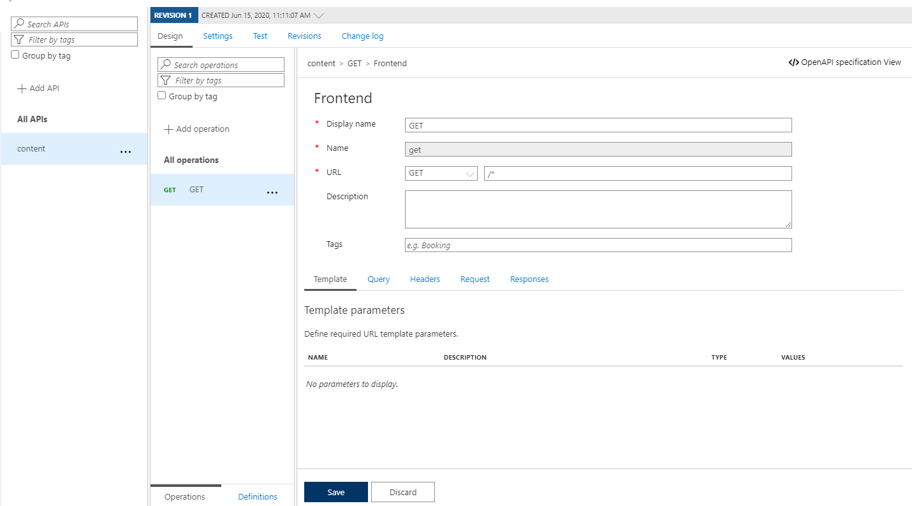

# demo-az-apim-storage

This project shows how to use API Managment to expose private blobs from Azure storage via HTTP. The solution uses API managment has a frontend and uses the storage account REST API as a backend.

##  Blob storage

Create a storage account and create a container with your content. The storage API should be configured for private access via an access key.

##  API Managment 

Using an policy expression we can configure API managment to create an authorization token by using the storage account access key. This key can be uses to access the storage account blobs.

### 1. Create and API Manamgent Instance
### 2. Create an API

Configure API:

### 3. Use an API policy to access storage account as a backend.

Select a reference policy base on the API Managment SKU:
- https://github.com/ncrtc/demo-az-apim-storage/blob/master/policy-standard.xml

In some scenaios a x-ms-privatelink-id header added to the backend call. In this case the following policy will apply:
https://github.com/ncrtc/demo-az-apim-storage/blob/master/policy-x-ms-privatelink-id.xml

In the selected policy replace the three placeholders:
 - YOUR_STORAGE_ACCOUNT_NAME_HERE
 - YOUR_STORAGE_CONTAINER_NAME_HERE
 - YOUR_STORAGE_ACCESS_KEY_HERE

### Reference
- https://docs.microsoft.com/en-us/rest/api/storageservices/get-blob
- https://docs.microsoft.com/en-us/rest/api/storageservices/authorize-with-shared-key
